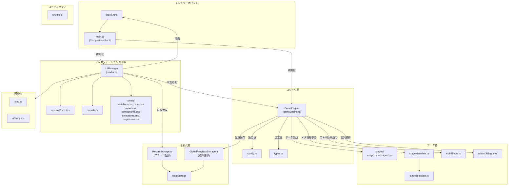
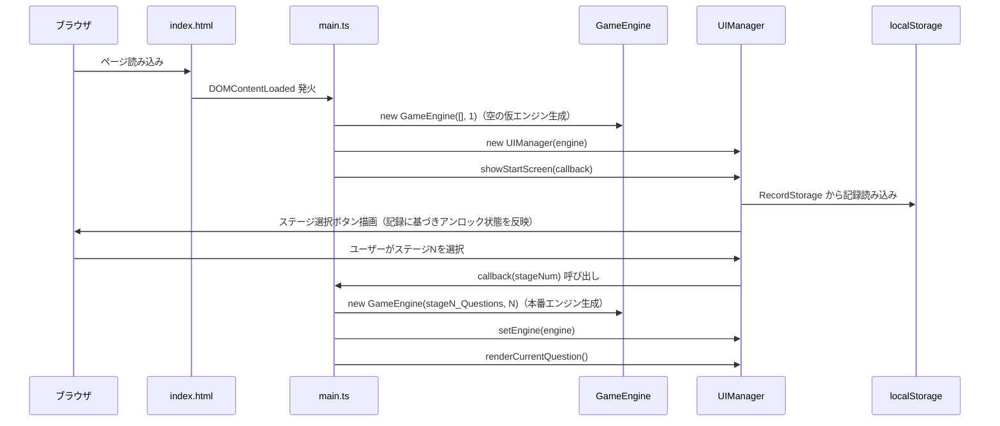
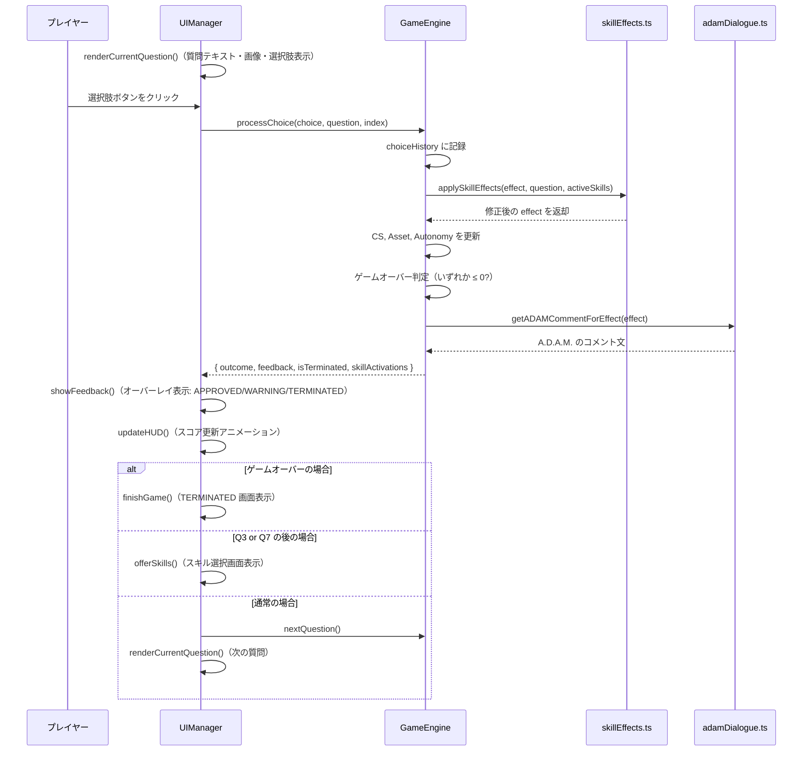
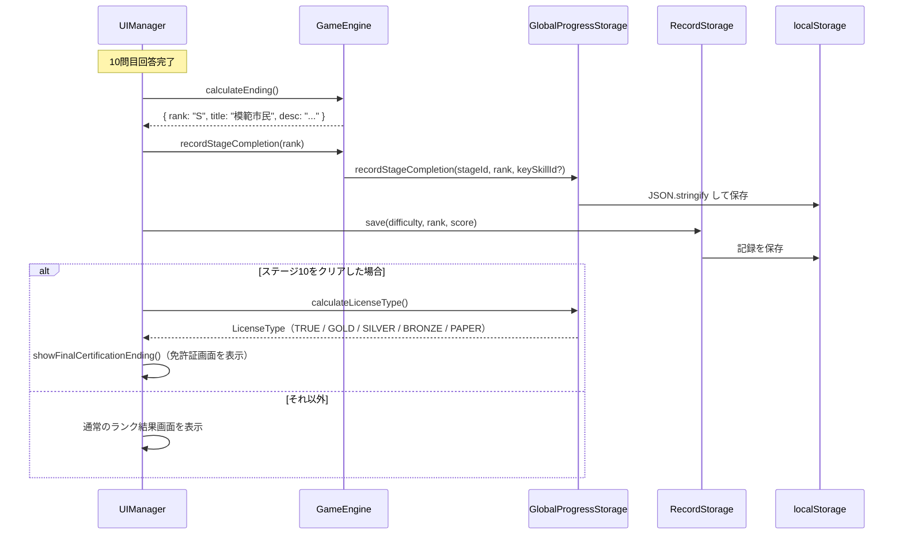
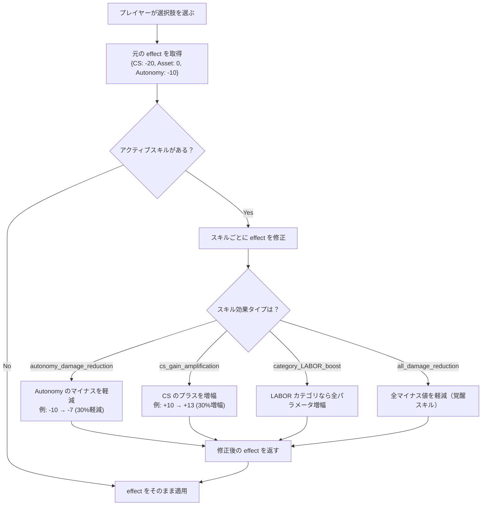

# 「大人免許 (Adult Certification)」リポジトリ完全ガイド

> 新卒エンジニア向け・初見でも迷わないためのオンボーディングドキュメント

---

## 1. プロジェクト概要

### これは何？

「**大人免許 (License to Adult)**」は、ブラウザで遊べる**風刺系・教育アドベンチャーゲーム**です。

プレイヤーは **A.D.A.M.**（Autonomous Decision & Assessment Module）という AI 審査官に「大人としての適性」を試されます。税金、労働法、契約、社会生活といった「学校では教わらないけど知らないと詰む」知識を、ディストピア的な世界観の中でゲームとして学ぶことができます。

### ゲームの流れ（ざっくり）

```
タイトル画面 → ステージ選択 → 10問の質問に回答
  → 質問3問目の後にスキル選択
  → 質問7問目の後にスキル選択
  → 10問終了 → ランク判定 (S/A/B/C)
  → 全10ステージをクリア → 最終免許判定 (TRUE/GOLD/SILVER/BRONZE/PAPER)
```

### コアメカニクス

- **3パラメータ制**: プレイヤーは CS（社会的信用）、Asset（資産）、Autonomy（自律性）の3つの数値を管理する。どれか1つでも0以下になるとゲームオーバー（TERMINATED）。
- **スキルシステム**: ステージ中に2回、2択のスキル選択がある。スキルはパッシブ効果を持ち、以降の選択肢の結果を自動的に変化させる。
- **キースキル**: 各ステージに1つ「キースキル」があり、特定の質問で正しい行動を取ると獲得条件を満たせる。全10個集めるとTRUEエンディング。
- **5段階エンディング**: 全ステージ通算の成績で最終的に受け取る「免許証」が変わる。

---

## 2. 技術スタック

### 一覧

| カテゴリ | 技術 | バージョン | 役割 |
|---------|------|-----------|------|
| ビルドツール | **Vite** | 7.2.4 | 高速な開発サーバー & バンドラー |
| 言語 | **TypeScript** | 5.9.3 | strict モードで型安全を強制 |
| パッケージマネージャ | **Bun** | - | npm の高速代替。テストランナーも兼ねる |
| ユニットテスト | **Bun Test** | - | Bun 組み込みのテストフレームワーク（88+テスト） |
| E2Eテスト | **Playwright** | 1.58.0 | ブラウザ自動操作によるエンドツーエンドテスト |
| リンター | **ESLint** | 9.18.0 | コード品質チェック |
| フォーマッター | **Prettier** | 3.5.3 | コード整形 |
| CI/CD | **GitHub Actions** | - | PR 自動レビュー & Claude Code 連携 |
| スタイリング | **Vanilla CSS** | - | フレームワーク不使用。CSS Variables + Flexbox/Grid |
| デプロイ先 | **itch.io** | - | ゲーム配信プラットフォーム |

### 設計上の特徴

- **ランタイム依存ゼロ**: `devDependencies` のみで、本番ビルドに外部ライブラリが一切入らない。TypeScript + Vanilla DOM だけで全機能を実現。
- **UIフレームワーク不使用**: React/Vue 等を使わず、DOM を直接操作。ゲームとして軽量さとパフォーマンスを優先した設計。
- **状態管理は自作クラス**: `GameEngine` クラスがゲーム状態を一元管理し、UI レイヤーから分離。

---

## 3. アーキテクチャ

### レイヤー構成図



### 依存関係のルール

最も重要なアーキテクチャルールは**一方向の依存関係**です。

```
UI → Logic → Data
UI → Storage
UI → I18n

Logic は UI に依存してはいけない
Data は Logic/UI に依存してはいけない
```

つまり `gameEngine.ts` の中に `document.getElementById()` のような DOM 操作は一切出てきません。これにより、GameEngine は Node.js / Bun の環境でもそのままユニットテストできます。

---

## 4. ディレクトリ構成

```
adult_certification/
│
├── index.html              # メインHTMLファイル（ゲームのDOM構造を定義）
├── package.json            # プロジェクト設定・スクリプト定義
├── tsconfig.json           # TypeScript 設定（strict モード）
├── vite.config.ts          # Vite ビルド設定（相対パス設定で itch.io 対応）
├── eslint.config.mjs       # ESLint 設定
├── .prettierrc.json        # Prettier 設定
├── bunfig.toml             # Bun 設定（テストルートの指定）
├── playwright.config.ts    # Playwright E2E テスト設定
├── build_itch.sh           # itch.io デプロイ用のビルド＆ZIP作成スクリプト
│
├── src/                    # ★ ソースコード本体
│   ├── main.ts             # エントリーポイント。GameEngine と UIManager を生成
│   ├── config.ts           # ゲーム設定定数（スキルオファー位置、ランク閾値等）
│   ├── types.ts            # TypeScript 型定義（Question, Choice, Skill, GameState等）
│   ├── style.css           # CSS エントリーポイント（各モジュールを @import）
│   │
│   ├── logic/              # ★ ロジック層（DOM 非依存・テスト可能）
│   │   └── gameEngine.ts   #   ゲームエンジン本体
│   │
│   ├── ui/                 # ★ プレゼンテーション層
│   │   ├── render.ts       #   UIManager クラス（全 DOM 操作を集約）
│   │   ├── overlayVerdict.ts # オーバーレイ表示の判定ロジック
│   │   └── domIds.ts       #   DOM 要素 ID の定数管理
│   │
│   ├── data/               # ★ データ定義（静的データ）
│   │   ├── stages/         #   各ステージの質問データ
│   │   │   ├── stageTemplate.ts  # ファクトリ関数
│   │   │   ├── stage1.ts   #   ステージ1: 社会への出発便
│   │   │   ├── stage2.ts   #   ステージ2: 労働
│   │   │   ├── ...         #   ステージ3〜9
│   │   │   └── stage10.ts  #   ステージ10: 最終試験
│   │   ├── stageMetadata.ts    # 各ステージのメタ情報（テーマ、スキル、閾値）
│   │   ├── skillEffects.ts     # スキル効果のレジストリ＆適用ロジック
│   │   ├── adamDialogue.ts     # A.D.A.M. の台詞データ
│   │   └── question_sources/   # 質問作成のリサーチ資料（実行には使わない）
│   │
│   ├── storage/            # ★ 永続化層
│   │   ├── RecordStorage.ts        # ステージ別の記録保存
│   │   └── GlobalProgressStorage.ts # 全ステージ通算の進捗管理
│   │
│   ├── i18n/               # ★ 多言語対応
│   │   ├── lang.ts         #   言語切替（JP/EN）と t() 関数
│   │   └── uiStrings.ts   #   UI テキストの翻訳定義
│   │
│   ├── utils/              # ★ ユーティリティ
│   │   └── shuffle.ts      #   Fisher-Yates シャッフルアルゴリズム
│   │
│   ├── assets/             # 画像アセット
│   │   ├── s{N}_q{YY}.png  #   各質問の画像（100枚: 10ステージ×10問）
│   │   ├── ADAM.png         #   A.D.A.M. マスコット
│   │   ├── logo_v7.png     #   タイトルロゴ
│   │   ├── license_*.png   #   エンディング免許証画像（5種）
│   │   └── alternatives/   #   ボツ案・代替画像
│   │
│   └── styles/             # モジュラー CSS
│       ├── variables.css   #   デザイントークン（色、間隔、フォント）
│       ├── base.css        #   基本スタイル
│       ├── layout.css      #   レイアウト
│       ├── components.css  #   コンポーネント
│       ├── animations.css  #   アニメーション
│       └── responsive.css  #   レスポンシブ対応
│
├── tests/                  # ユニットテスト
│   ├── logic/
│   │   └── gameEngine.test.ts      # GameEngine のテスト（40+ テスト）
│   └── data/
│       ├── skillEffects.test.ts    # スキル効果のテスト
│       ├── stageValidation.test.ts # ステージ構造の整合性テスト
│       └── stages/
│           └── stage10.test.ts     # ステージ10固有のテスト
│
├── e2e/                    # E2E テスト
│   └── license.spec.ts    # 免許システムの統合テスト（6テスト）
│
├── scripts/                # 開発補助スクリプト
│   ├── check_i18n.mjs     # 多言語対応の検証
│   ├── compare_stages.mjs # ステージ間の比較レポート
│   └── simulate_stage.mjs # ステージのバランスシミュレーション
│
├── docs/                   # 設計ドキュメント群
│   ├── ARCHITECTURE.md     # アーキテクチャ概要
│   ├── PRODUCT.md          # プロダクト概要・ターゲットユーザー
│   ├── DEVELOPMENT.md      # 開発環境セットアップ・テスト戦略
│   ├── QUESTION_DESIGN_GUIDE.md  # 質問設計ガイド
│   ├── SKILL_DESIGN_GUIDE.md     # スキル設計ガイド
│   ├── PARAMETER_PHILOSOPHY.md   # パラメータ設計思想
│   ├── ADAM_STYLE_GUIDE.md       # A.D.A.M. の台詞スタイルガイド
│   ├── IMAGE_GENERATION_WORKFLOW.md # AI 画像生成パイプライン
│   ├── PRODUCTION_GUIDE.md       # ステージ制作ワークフロー
│   └── UI_UX_GUIDELINES.md       # UI/UX ガイドライン
│
├── public/                 # Vite の公開ディレクトリ（ADAM.png, logo）
├── dist/                   # ビルド成果物（git 管理外が望ましい）
├── screenshots/            # スクリーンショット集（PC/モバイル）
└── .github/
    └── workflows/
        ├── claude.yml              # GitHub Issues/PR で @claude メンション対応
        └── claude-code-review.yml  # PR 自動コードレビュー
```

---

## 5. I/O フロー（データの流れ）

### 5.1 ゲーム起動〜ステージ選択



### 5.2 質問への回答フロー



### 5.3 ステージ終了〜エンディング判定



### 5.4 スキル効果の適用フロー



---

## 6. 主要コードの解説

### 6.1 `types.ts` — 型定義（全体の設計図）

このファイルがプロジェクト全体の「辞書」にあたります。ここを読めばゲームのデータ構造が全て分かります。

```typescript
// 質問データの型
interface Question {
    id: string;           // "s1_q01" (ステージ1・質問1)
    category: string;     // "FINANCE", "LABOR", "ADMIN" 等
    text: string;         // 質問文（日本語）
    textEN?: string;      // 質問文（英語、オプション）
    imagePrompt: string;  // 画像生成用プロンプト
    imagePath?: string;   // 画像ファイルパス
    choices: Choice[];    // 選択肢の配列
}

// 選択肢の型
interface Choice {
    text: string;
    effect: { CS: number; Asset: number; Autonomy: number };  // パラメータ変動
    feedback: string;     // 選択後のフィードバック文
    verdict?: 'APPROVED' | 'WARNING' | 'NEUTRAL';            // 結果ラベル
    lockRequirements?: { CS?: number; Asset?: number; Autonomy?: number };
    // ↑ この選択肢を選ぶために必要な最低パラメータ値
}

// ゲーム状態
interface GameState {
    CS: number;                              // 社会的信用スコア
    Asset: number;                           // 資産
    Autonomy: number;                        // 自律性
    skills: string[];                        // 獲得スキルID一覧
    keySkills: string[];                     // 獲得キースキルID一覧
    currentQuestionIndex: number;            // 現在の質問番号（0始まり）
    currentStage: number;                    // 現在のステージ番号
    isGameOver: boolean;                     // ゲームオーバーフラグ
    questions: Question[];                   // このステージの全質問
    choiceHistory: Record<string, number>;   // questionId → 選んだ選択肢のインデックス
}
```

**ポイント**: `choiceHistory` は「キースキル獲得条件」の判定に使われます。例えばステージ1のキースキル「仲介術」は、Q5で選択肢B（index: 1）を選んでいたときだけ獲得可能です。

### 6.2 `gameEngine.ts` — ゲームの頭脳

GameEngine はゲーム全体のロジックを持つクラスです。**DOM には一切触りません**。

```typescript
class GameEngine {
    state: GameState;           // ゲーム状態
    activeSkills: Skill[];      // 現在有効なスキル
    private globalProgress: GlobalProgressStorage;

    // コンストラクタ：質問配列とステージ番号を受け取り、初期パラメータを設定
    constructor(questions: Question[], stageId: number = 1) { ... }

    // 現在の質問を取得（全問終了なら null）
    getCurrentQuestion(): Question | null { ... }

    // 選択肢がロックされているか判定（パラメータ不足で選べない）
    isChoiceLocked(choice: Choice): boolean { ... }

    // ★ 最重要メソッド：選択肢を処理する
    processChoice(choice, question, choiceIndex): {
        outcome: { CS, Asset, Autonomy },  // 適用されたパラメータ変動
        feedback: string,                   // フィードバックテキスト
        isTerminated: boolean,              // ゲームオーバーか
        skillActivations: SkillActivation[] // 発動したスキルの情報
    }

    // ステージ終了時のランク計算（CS値ベース）
    calculateEnding(): { rank, title, desc }

    // スキルを追加
    addSkill(skill: Skill): void

    // キースキルの獲得条件を満たしているか判定
    isKeySkillEarned(skill: Skill): boolean
}
```

**processChoice の処理順序**:
1. 選択肢がロックされていないか検証
2. `choiceHistory` に選択を記録
3. `applySkillEffects()` でスキル効果を適用した修正値を計算
4. パラメータ（CS, Asset, Autonomy）を更新
5. ゲームオーバー判定（いずれかが ≤ 0）
6. A.D.A.M. のコメントを生成
7. 結果オブジェクトを返す

### 6.3 `render.ts`（UIManager）— ゲームの顔

UIManager は全ての DOM 操作を担当する巨大なクラス（約850行）です。

**主要メソッド一覧**:

| メソッド | 役割 |
|---------|------|
| `showStartScreen(callback)` | タイトル画面表示。ステージ選択ボタン生成、言語切替ボタン設置 |
| `renderCurrentQuestion()` | 質問テキスト、画像、選択肢ボタンを描画 |
| `handleChoice(choice, question, index)` | ユーザーの選択を受け processChoice を呼び、結果を表示 |
| `showFeedback(feedback, ...)` | 結果オーバーレイ（APPROVED/WARNING/TERMINATED）を表示 |
| `offerSkills(offerNumber)` | スキル選択画面を表示（2択） |
| `updateHUD()` | CS/Asset/Autonomy の数値表示を更新（ポップアップアニメーション付き） |
| `updateMascot(mood)` | A.D.A.M. の表情を切替（happy/glitch/neutral） |
| `showAdamSpeech(lines)` | A.D.A.M. の台詞をタイプライター風に表示 |
| `finishGame()` | ステージ終了画面（ランク表示） |
| `showFinalCertificationEnding()` | 最終免許証画面（ステージ10クリア後） |

**画像のロード方法**: Vite の `import.meta.glob` を使っている点に注目。

```typescript
const images = import.meta.glob('../assets/*.{png,jpg,jpeg,webp}', { eager: true });
```

これにより、ビルド時に全画像アセットがバンドルされ、ハッシュ付きURLとして利用可能になります。個別の `import` 文を100個書く必要がなくなります。

### 6.4 `skillEffects.ts` — レジストリパターンによるスキル効果システム

スキル効果はハードコーディングではなく、**レジストリパターン**で管理されています。

```typescript
// 効果ハンドラのレジストリ（型 → 処理関数 のマッピング）
const effectHandlers: Record<string, EffectHandler> = {
    'autonomy_damage_reduction': (effect, _question, skillEffect) => {
        // Autonomy がマイナスの時だけ、指定割合で軽減
        if (effect.Autonomy < 0) {
            effect.Autonomy = Math.round(effect.Autonomy * (1 - skillEffect.value));
        }
        return effect;
    },
    'cs_gain_amplification': (effect, _question, skillEffect) => {
        // CS がプラスの時だけ、指定割合で増幅
        if (effect.CS > 0) {
            effect.CS = Math.round(effect.CS * (1 + skillEffect.value));
        }
        return effect;
    },
    'category_LABOR_boost': (effect, question, skillEffect) => {
        // LABOR カテゴリの質問に限り、全パラメータを増幅
        if (question.category === skillEffect.category) {
            // 全パラメータに適用
        }
        return effect;
    },
    // ... 他にも多数
};
```

**なぜレジストリパターンか？**: 新しいスキル効果タイプを追加する際、このマッピングに1エントリ追加するだけで済みます。`if/else` の連鎖ではないので拡張性が高いです。

### 6.5 `GlobalProgressStorage.ts` — エンディング判定のロジック

全10ステージの成績を `localStorage` で永続管理し、最終エンディング（免許タイプ）を算出します。

```typescript
calculateLicenseType(): LicenseType | null {
    // ステージ10未クリアなら判定しない
    if (!this.progress.completedStages.includes(10)) return null;

    // 最優先: 全10個のキースキルを集めたら TRUE エンディング
    if (this.hasAllKeySkills()) return 'TRUE';

    // それ以外: 全ステージの「最低ランク」で判定
    const worstRank = this.getWorstRank();
    switch (worstRank) {
        case 'S': return 'GOLD';    // 全ステージS → ゴールド免許
        case 'A': return 'SILVER';  // 最低がA → シルバー免許
        case 'B': return 'BRONZE';  // 最低がB → ブロンズ免許
        case 'C': return 'PAPER';   // 最低がC → ペーパー免許
    }
}
```

ランクは「更新時に最良の記録のみ保存」される仕組みです。つまりリプレイでSを取れば、以前のCが上書きされます。

### 6.6 `config.ts` — マジックナンバーの排除

ゲーム全体の設定値が一箇所に集約されています。

```typescript
export const CONFIG = {
    SKILL_OFFER_POSITIONS: [2, 6],    // Q3の後（index 2）とQ7の後（index 6）
    QUESTIONS_PER_GAME: 10,
    TOTAL_STAGES: 10,
    BUTTON_DELAY_MS: 500,             // ボタンの連打防止ディレイ
    RANK_THRESHOLDS: { S: 200, A: 150, B: 100 },
    DANGER_THRESHOLDS: { CS: 0, Asset: 0, Autonomy: 0 },
    DEFAULT_INITIAL_PARAMS: { CS: 100, Asset: 100, Autonomy: 100 },
    STORAGE_KEYS: {
        RECORDS: 'ac_records',
        GLOBAL_PROGRESS: 'ac_global_progress',
    },
} as const;
```

「`as const`」により、全ての値がリテラル型として扱われ、意図しない変更をコンパイル時に防げます。

### 6.7 `main.ts` — Composition Root パターン

エントリーポイントは極めてシンプルです。全てのステージデータをインポートし、DOMContentLoaded でアプリケーションを起動します。

```typescript
// 10ステージ全ての質問データをレジストリに登録
const stageQuestions: Record<number, Question[]> = {
    1: stage1Questions, 2: stage2Questions, /* ... */ 10: stage10Questions,
};

document.addEventListener('DOMContentLoaded', () => {
    let engine = new GameEngine([], 1);          // 仮エンジン
    const ui = new UIManager(engine);

    ui.showStartScreen((stageNum: number) => {   // ステージ選択コールバック
        engine = new GameEngine(selected, stageNum); // 本番エンジン生成
        ui.setEngine(engine);
        ui.renderCurrentQuestion();               // ゲーム開始！
    });
});
```

**Composition Root パターン** とは、依存関係の組み立て（配線）をアプリケーションのエントリーポイントに限定する設計手法です。各モジュールは自身の責務のみに集中できます。

---

## 7. ステージデータの構造（質問の書き方）

各ステージは `src/data/stages/stageN.ts` で定義されます。1ステージ = 10問です。

```typescript
// stage1.ts の例
export const stage1Questions: Question[] = [
    {
        id: "s1_q01",
        category: "FINANCE",
        text: "新社会人になり、クレジットカードを初めて作った。リボ払いを勧められたが、どうする？",
        textEN: "You just started your first job...",
        imagePrompt: "Scene: A shiny new credit card resting on a cafe table...",
        imagePath: "s1_q01.png",
        choices: [
            {
                text: "毎月の支払いが一定で楽そうなので、リボ払いを設定する。",
                effect: { CS: 0, Asset: -30, Autonomy: -10 },  // 資産-30、自律性-10
                verdict: "WARNING",
                feedback: "年利15%前後で「返済が終わらない設計」になりがち...",
                lockRequirements: null  // 誰でも選べる
            },
            {
                text: "年利を確認し、なんとなくでリボ払いや分割払いを利用しない。",
                effect: { CS: 10, Asset: 0, Autonomy: 10 },   // 信用+10、自律性+10
                verdict: "APPROVED",
                feedback: "クレジットカードの明細チェックがお金の自衛の基本。",
                lockRequirements: null
            }
        ]
    },
    // ... Q2〜Q10
];
```

**lockRequirements の例**: `{ CS: 80 }` と設定すると、CS が80未満のプレイヤーはその選択肢を選べません（グレーアウト表示）。

---

## 8. テスト戦略

### ユニットテスト（`bun test`）

```bash
bun test              # 全テスト実行
bun test --watch      # ファイル変更監視モード
bun test --coverage   # カバレッジレポート付き
```

テストは `tests/` ディレクトリに配置され、主に以下をカバーしています。

**gameEngine.test.ts（40+テスト）**: 初期化、選択処理、ロック判定、ゲームオーバー判定、ランク計算、スキル管理など。GameEngine が DOM に依存しないため、Bun 上で純粋にテスト可能。

**skillEffects.test.ts**: 18種類の効果タイプの動作確認。ダメージ軽減率、増幅率が正確か。

**stageValidation.test.ts**: 全ステージのデータ構造が正しいか（必須フィールドの存在確認、ID の命名規則チェック等）。

### E2Eテスト（Playwright）

```bash
bun run test:e2e          # ヘッドレスで実行
bun run test:e2e:headed   # ブラウザ表示つきで実行
bun run test:e2e:ui       # Playwright UI モード
```

`e2e/license.spec.ts` では、5種類の免許エンディング全てが正しく表示されるかを、実際にゲームを操作して検証しています。

---

## 9. 開発コマンド一覧

| コマンド | 説明 |
|---------|------|
| `bun install` | 依存パッケージのインストール |
| `bun run dev` | 開発サーバー起動（http://localhost:5173） |
| `bun run build` | 本番ビルド（`tsc` → `vite build`、`dist/` に出力） |
| `bun run preview` | ビルド結果のプレビュー |
| `bun test` | ユニットテスト実行 |
| `npm run lint` | ESLint でコード品質チェック |
| `npm run lint:fix` | ESLint の自動修正 |
| `npm run format` | Prettier でコード整形 |
| `bun run test:e2e` | Playwright E2Eテスト実行 |
| `bash build_itch.sh` | itch.io 用の ZIP ファイル作成 |

---

## 10. CI/CD（GitHub Actions）

### claude.yml
GitHub の Issue や PR コメントで `@claude` とメンションすると、Claude Code が自動で応答します。コードの質問に答えたり、修正案を提示したりします。

### claude-code-review.yml
PR が作成されると自動的に Claude Code によるコードレビューが走ります。

---

## 11. その他の重要ポイント

### 多言語対応（i18n）

`t()` 関数でテキストを切り替えます。

```typescript
import { t } from '../i18n/lang';

// 日本語が第1引数、英語が第2引数（オプション）
const label = t("社会的信用", "Credit Score");
// → currentLang === 'ja' なら "社会的信用"
// → currentLang === 'en' なら "Credit Score"
```

全ての UI テキストは `uiStrings.ts` に関数として定義されており、`t()` を内部で呼ぶことで動的に言語を切り替えられます。

### localStorage の構造

ゲームは2つのキーで `localStorage` にデータを保存します。

```json
// ac_records: ステージ別のベスト記録
{
  "Stage1": { "rank": "S", "score": 210, "date": "2026-01-30" },
  "Stage2": { "rank": "A", "score": 170, "date": "2026-01-31" }
}

// ac_global_progress: 全ステージの通算進捗
{
  "stageRanks": { "1": "S", "2": "A" },
  "keySkillsCollected": ["MEDIATION", "EVIDENCE_CHAIN"],
  "completedStages": [1, 2]
}
```

### itch.io デプロイ

`build_itch.sh` が `npm run build` → `dist/` の中身を ZIP化 というシンプルなフローを自動化しています。`vite.config.ts` で `base: './'` を設定しているため、itch.io の iframe 内でも相対パスで正しくアセットが読み込まれます。

### コーディング規約

- **ファイル名**: camelCase（例: `gameEngine.ts`）
- **クラス名**: PascalCase（例: `GameEngine`）
- **定数**: UPPER_SNAKE_CASE（例: `RANK_THRESHOLDS`）
- **`any` 禁止**: ESLint の `@typescript-eslint/no-explicit-any: "error"` で強制
- **`as const`**: 設定オブジェクトにはリテラル型推論を適用
- **依存方向**: UI → Logic → Data（逆方向禁止）

---

## 12. 開発を始めるときの推奨手順

1. **まず遊ぶ**: `bun install && bun run dev` で実際にゲームをプレイして全体像を掴む
2. **型定義を読む**: `src/types.ts` でデータ構造を理解する
3. **ステージデータを読む**: `src/data/stages/stage1.ts` で質問の書き方を把握する
4. **GameEngine を読む**: `src/logic/gameEngine.ts` でコアロジックを理解する
5. **テストを実行する**: `bun test` で既存テストが通ることを確認する
6. **ドキュメントを読む**: `docs/` 配下のガイドを必要に応じて参照する

---

*このドキュメントは 2026年2月7日に自動生成されました。*
